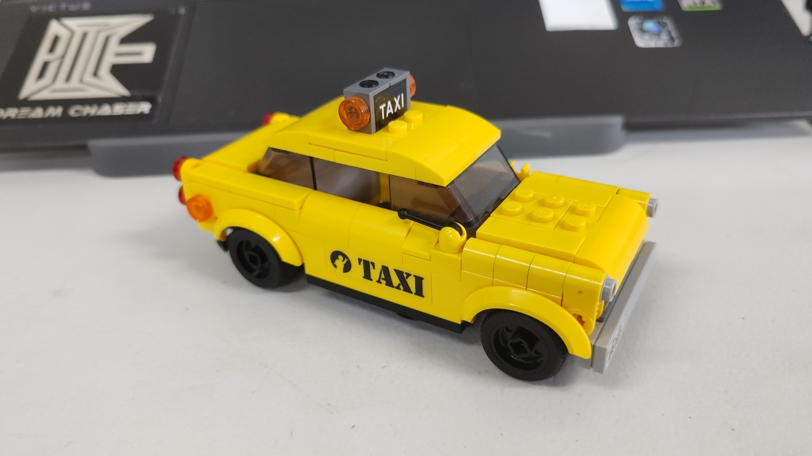

# ImageTitan

场地图像采集车

## version 1

整车运动方式参考普通汽车，即后轮电机驱动，前轮舵机转向

上位机为树莓派4B：运行ROS、采集摄像头数据并保存上传服务器、接受遥控器指令并串口发给下位机

下位机为ESP32：运行FOC控制电机，控制舵机

开发板为[栈擎开发板](http://stackforce.cc)（提供了FOC驱动），遥控器为PS2手柄 USB无线，电机为2208 BLDC，舵机使用SG90（或者机械结构调整为其它常见PWM舵机）

2024.10.4

打通了电控部分的开发工作，实现了遥控器控制电机和舵机。

剩下的工作

- 机械设计：包括底盘和外壳的设计、发加工、装配。需考虑USB摄像头布线问题，可能需要把线剪短了焊起来或找商家定制厘米级的长度
- 选电源：目前打算树莓派和电机分开供电，树莓派用[树莓派电池](https://item.taobao.com/item.htm?abbucket=12&id=751621091451&ns=1&pisk=g1KKL1YDnfcHvKea47gGrRfz_Dkis3pEtBJbq_f3PCd9F1qoLM0P2QC9a6bhA6qR2LdyZQprLT1WNQCk-VmDLpSPVjq-mmvFcQlMzQQCOR96QtBQRmVpdMyCVjcm2P218XjWtjxRq1a1316CFwZSBc65Fg6CFaMO1TB4PWO5VAHOn967P_175O6c1WaCRT_1fTWddu6CRAp1_Tl51bC_d_qJzZQLndyAauZWX9QsSp1sxKK1pFCvdHEz48WdJs9C6jl2DE76UaKzUuQJdERPhBNIiwJWWCBd2c4CcdLWMO-ImWBw-d9c1KebcpjdeZs5W8ZWBM5G5hjjc5Bw5pYWYBe8V9-HmaCVWYZPrGtclEOLUxJ1ATOPu3c4Y69W3n8cDc4CcdLWMUIzbnxA58VcMT4IBAUzzw6wpp_bJbN3iA6Oivn8zz7ZQOCmBAUzzw6NBsDKezzP7A5..&priceTId=2147bf1917280554050132751e6383&spm=a21n57.1.item.10.37e7523cHEFCcB&utparam=%7B%22aplus_abtest%22%3A%2263e2c765721751ee8d42375746125377%22%7D&xxc=taobaoSearch)（需要测试续航，如果不行准备用充电宝），电机根据续航和整车体积的要求选普通航模电池
- 测试六摄像头运行：按照之前的猜想，树莓派跑六个摄像头卡死是CPU核数不够，但后来一直没试过单线程读取多个摄像头的方案，以及帧率够不够
- 整合优化：将翌先的图像采集代码节点和其它ROS节点封装进一个launch文件，设置开机自启动，做一些遥控模式、指示灯等等方便人机交互
- 场地测试：字面意思
- 文档撰写：根据采集车的使用方法和使用人群，补充部署和使用说明

## version 2 [doge]

v1如果做出来肯定是能用的，但是在过程中遇到一些问题，下面是一些优化点和碎碎念，如果后续有优化的必要可以考虑

- 后轮用一个电机驱动：起初选电机是参考[桌面级轮足机器人](https://www.bilibili.com/video/BV174421S78Y/?spm_id_from=333.999.0.0)选的，看着很精致，电机小巧，BLDC运行噪声也小，就搞了两个试试。直到电控部分完成了要开始设计底盘机械结构了才想起来人家那是轮足，我这是普通轿车的结构，俩后轮其实应该用一根杆连起来，通过齿轮用一个电机传动。俩轮子分开控制虽然问题也不大，就是有点怪怪的，而且用一个电机驱动成本可以更低。
- 换开发板：选这个开发板，是刷到了[这个视频](https://www.bilibili.com/video/BV1BZ421g7xQ/?spm_id_from=333.788&vd_source=1d0891b41fe4e23dbf197eaf61dfa468)，板子做得很精致又可以堆叠又正好提供了小功率双路BLDC的驱动，既满足我这需求又抓住我的审美了，谁知买来之后，代码文档是一点儿没有，官方文档中实际有用的东西少得可怜（其实也就是告诉你要怎么把代码烧进去，没了，嘻嘻）；然后出于商业考虑，所有的源文件还都是.a，不好反向工程，只留出头文件的接口给你调用，由于没有任何代码文档，所有函数的用法要靠函数名自己猜+问客服，属实是难受又抽象。这还没完，客服发出来的代码还有bug，编译缓存没清，注册码改了死活烧不进去（注册码的部分也被封成.a了，只留出一个resister callback，嘻嘻）。不过话说回来，板子做的是真不错，FOC算法目前看起来也挺稳定，可能初创小厂的原因吧，文档啥的不完善，表示理解。目前这个板子的价值就是用它电机驱动板和电机主控上配套的FOC，主控板除了控制舵机以及转发一下数据给电机主控啥也没干，资源其实大有冗余，后续想自研FOC，根据需求自己设计PCB，不过因为没接触过，要做得学一段时间，等学期末考完试了可以做。
- 把相机的USB取代掉：现在四个摄像头加上手柄接收端，需要带小型拓展坞；相机USB头本身体积就大，线也很长，如果这车要批量使用且商家不能定制厘米级的线，每次焊线也挺麻烦的，要么就是机械设计上做一个比较臃肿的外壳专门用来放那一大坨线。但要取代USB，就得解析USB协议，还要考虑怎么跟树莓派连接，目前只是想想，没有具体方向。