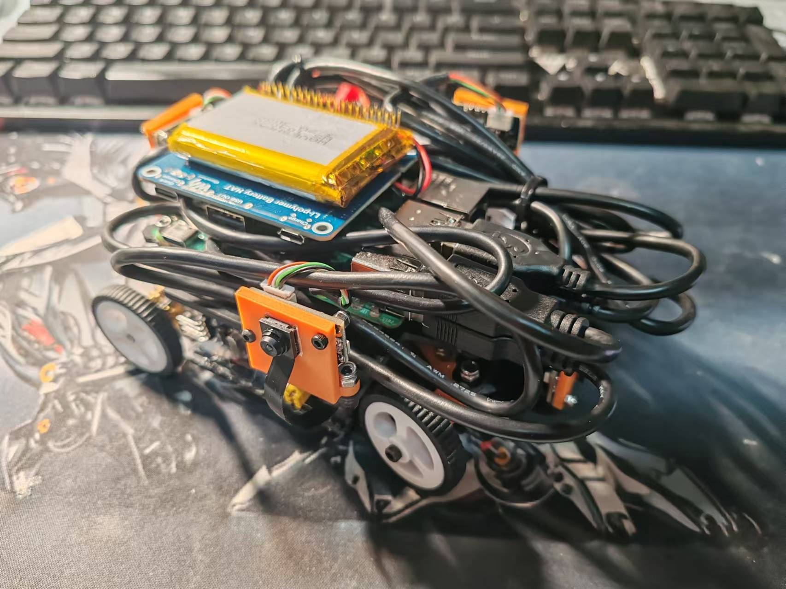
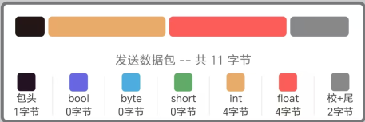
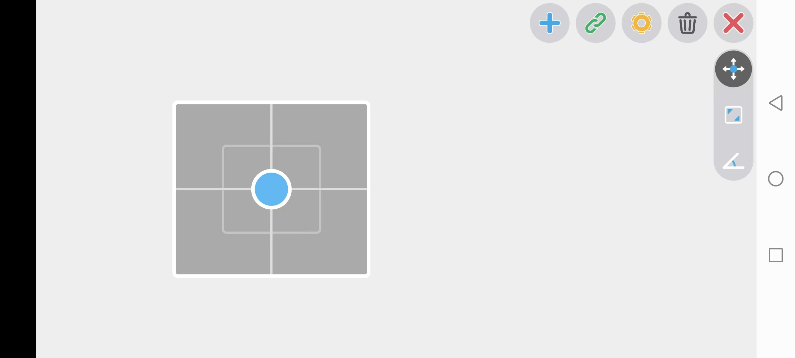

# ImageTitan

> 图像采集环视小车

| 积木模型                                                     | 实际模型                                                     |
| ------------------------------------------------------------ | ------------------------------------------------------------ |
|  |  |


## 整体效果

完成了规定尺寸的遥控图像采集车的全部开发，实车尺寸约为160mm * 120mm * 70mm，使用手机的蓝牙调试器进行遥控，使用笔记本电脑ssh远程连接树莓派、启动launch文件并使用rosbag命令进行数据采集。

整车为阿克曼底盘构型，后轮用带编码器和减速箱的直流马达GA12-N20驱动，前轮由舵机MG90S配合金属舵盘控制转向。上位机用树莓派4B 4G内存，下位机使用STM32F103C8T6，电机驱动为TB6612FNG，蓝牙模块为HC-04，树莓派电池为5V 3000mAh，小车电池为7.4V 380mAh，摄像头为500万30帧OV5693 120度视场角。

机械结构以两块碳板和若干铜柱为骨架支撑，下层放置电机、舵机、电机驱动板、STM32主控板和蓝牙模块，使用手工打线制成的超短杜邦线；上层放置树莓派板卡、两块电池、四个摄像头以及它们附带的USB线。

STM32主控代码在lower目录下，树莓派板卡代码在upper目录下，代码中有对应的注释，此处不再对代码作梳理解释。


## 部署说明

整合了翌先的博客：https://blog.csdn.net/weixin_61967846/article/details/139688989?spm=1001.2014.3001.5501


**开发环境搭建：**

- 笔记本Windows系统上安装CubeMX和Keil用于调试下位机

- 树莓派烧录镜像“ubuntu-22.04-preinstalled-desktop-arm64+raspi.img；
    镜像下载地址：[Index of /releases/jammy](https://old-releases.ubuntu.com/releases/jammy/)

- 树莓派完成Ubuntu 22.04安装、安装ros2 humble、完成相关配置

    1. 使用鱼香ROS一键安装ROS2，依次选择命令1 1 2

        ```bash
        sudo wget http://fishros.com/install -O fishros && . fishros
        ```

    2. 设置ssh

        ```bash
        # 安装工具包
        sudo apt install net-tools
        sudo apt install openssh-server
         
        # 设置开机自动运行
        sudo systemctl enable ssh
        sudo systemctl start ssh
         
        # 查看SSH运行状态
        sudo systemctl status ssh
        ```

        之后在笔记本上的VSCode中，配置SSH文件中修改ip为刚才查到的树莓派的ip，连接，选择linux，输入密码即可。User指的是命令行中的前一个，如例子中的命令行显示为lamps-xe1@bit。

        ```json
        Host mypi
          HostName 192.168.1.109
          User lamps-xe1 
        ```

    3. 安装相关工具

        ```bash
        sudo apt update
        sudo apt upgrade
        sudo apt install -y python3-pip
        sudo pip3 install rosdepc
        sudo rosdepc init
        rosdepc update
        sudo apt install python3-colcon-ros
        ```


---

**构建与测试：**

下位机部分，用CubeMX生成keil工程并编译烧录即可

移动端使用蓝牙调试器，数据包如下：

| 包头           | 原数据                          | 校验和                               | 包尾           |
| -------------- | ------------------------------- | ------------------------------------ | -------------- |
| 0xA5（1 byte） | int（4 byte） + float（4 byte） | 原数据中所有字节和的低八位（1 byte） | 0x5A（1 byte） |



再添加摇杆控件并链接到对应数据，设置数据限幅为900




上位机部分：

首次开机需配合外接显示器查看ip，以后可使用ssh

```bash
ifconfig
```

远程连接到树莓派

```bash
ssh lamps-xe11@192.168.22.152 # @后的为树莓派ip，根据查到的ip对应修改
```

**在upper目录下**编译并刷新环境变量

```bash
colcon build
source ./install/setup.bash
```

接入相机后运行launch文件，开启所有摄像头并进行图像同步

```bash
ros2 launch img_capture start_cameras.py
```

运行rosbag命令开始录制

```bash
ros2 bag record -o your_video_name /camera1_10003_image /camera2_10003_image /camera3_10003_image /camera4_10003_image /stitched_10003_image # your_video_name 为自定义的名称
```

结束录制后回放并查看图像

```bash
ros2 bag play your_video_name
ros2 run rqt_image_view rqt_image_view
```


## 改进完善

1. 目前最致命的问题是，用树莓派运行图像采集的代码时画面会卡成PPT，应该是树莓派散热条件极差，芯片严重发烫导致的。另外如果能找到，最好将树莓派换成CPU核心数更多的板卡，这个问题应该能得到解决，同时，六个摄像头的需求应该也能满足。
2. 会画板子之后，把主控、电机驱动、蓝牙（或者wifi）模块、USB_hub画在一块板子上
3. 有了USB_hub并重画板子之后，可以添加上下位机的串口通讯，如此便可让树莓派自启运行launch文件，使用PS2手柄进行遥控并控制图像采集，避免了蓝牙范围有限以及连接不稳定的问题；另外还可将上位机的信息传给下位机作指示，如开机自启完成让下位机亮个灯。调试和交互更方便。完成以上两点之后，采集数据甚至不需要带笔记本电脑，直接接上电池开机，等待初始化指示灯亮起，用手柄并配合其它指示灯就可以完成数据采集，非常方便。
4. 摄像头的线剪短重焊，可以清爽不少
5. 将摄像头位置设计成可调的