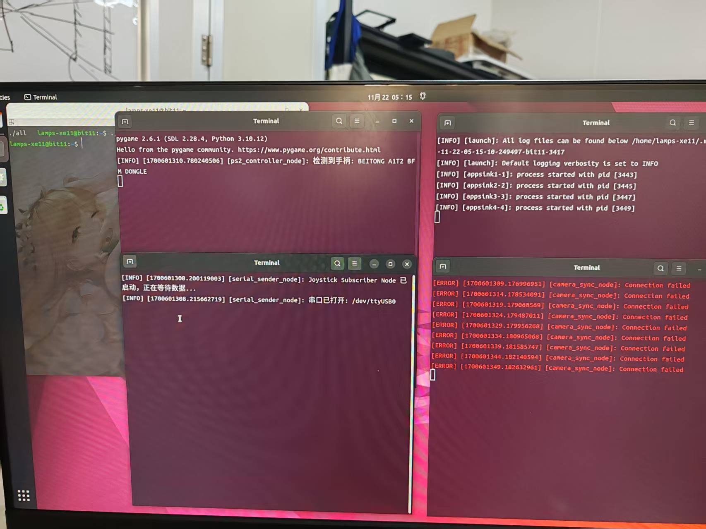

# 环视采图车使用说明


图采车配合手柄、无线键鼠（其实无线键盘就可以）和显示器使用，前者用于操控小车，后者用于启动程序或调试处理异常状况。（如果希望更方便一些省去键鼠也可以在ubuntu上配置自启动）


## 使用步骤

1. 给树莓派插入无线键鼠和手柄的USB接收端，连接好显示器，将手柄开机。

    

2. 按此按钮给树莓派上电

    

3. 插入下位机电池，拨动此开关给单片机上电，此时舵机会回正

    

4. ctrl+alt+t打开终端，输入以下命令并回车

    ```shell
    ./all_boot.sh
    ```

​	图中为程序运行的正常界面（注：右下终端的报错来自于已弃用的网络传输功能，忽略即可）

​	通过打印件的孔看到微微蓝光，表示程序开始运行

5. 手柄左侧遥控控制车辆移动，右侧A键控制采图开始或结束（按一下切换状态）

    

6. 拔掉显示器，将车放入场地后，按下A键开始采图，此时第四步中提到的微微蓝光熄灭（注：本来是有红光亮起的，但由于设计考虑不周，被打印件挡住了）

    

7. 手柄控制小车移动以采集图像数据，为了保证图像质量，小车移速设置得较慢，请耐心等待
8. 完成采图后，再次按A键结束采图，此时微微蓝光亮起
9. 连接显示屏，用U盘将home路径下image目录拷贝出来即可（注：请耐心等待进度条走完，点击弹出U盘后，稍等片刻后再拔出U盘，热插拔容易导致数据丢失，且建议在关闭设备前用自己电脑确认U盘中是否确实成功拷出了数据）
10. 确认成功拷出数据后，结束程序，长按第2步中的按钮，拨动第3步中的按钮，完成下电；并拔出下位机电池


## 注意事项

1. 下位机电池使用后一定记得拔出，长期插着及其不开开关，电池的漏电也会损耗电池寿命，并且存在安全隐患。另外，长时间未使用发现下位机无法正常启动（比如上位机程序检测不到串口，板子指示灯绿光微弱，舵机无力等现象）可以先尝试更换电池。
2. 采图尽快完成，相机发热严重，图像噪声明显增加，且长时间开启会软化PLA打印件，树莓派平台部分可能产生倾斜使车体重心偏移，关机冷却后对打印件产生塑性形变，导致车体容易倾倒，顶层平台进入相机视野等问题。
3. 如果需要定制相机位置，可修改/Components目录下相机台的SW文件并重新打印安装。
4. 小车还有很多可以优化和改进的地方，如果需要任何帮助，欢迎联系瑞祥~~